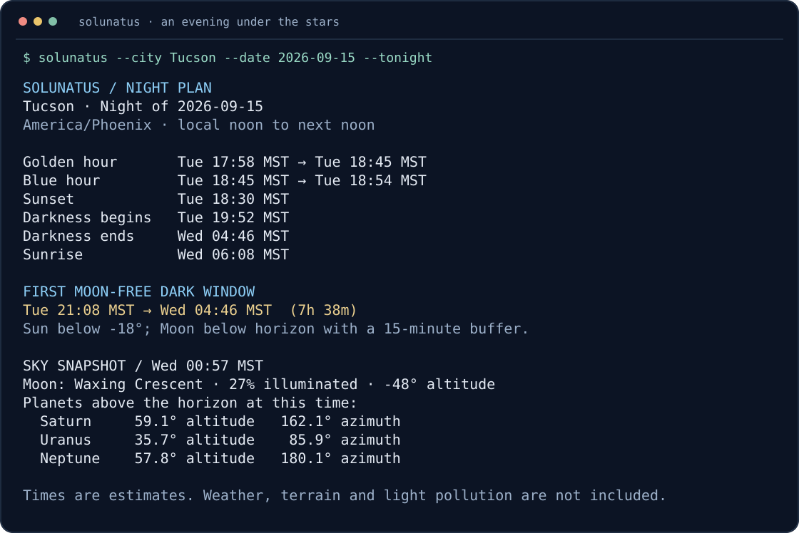

# Solunatus

**Plan your next night under the stars—from your terminal.**

[](https://crates.io/crates/solunatus)
[](https://github.com/FunKite/solunatus/actions/workflows/rust.yml)
[](https://docs.rs/solunatus)
[](LICENSE)

Find golden hour, moon-free darkness, and where the planets will be. Solunatus combines a live sky dashboard, photography calendars, and a Rust astronomy library. Core calculations run locally, without an account or API key.

[Get started](#get-started) · [Plan a night](#plan-a-night) · [Observing recipes](docs/features/observing.md) · [Rust API](https://docs.rs/solunatus)



*Actual `--night` output, available in v0.7.0. [How the preview is generated](docs/features/observing.md#readme-preview).*

## Why take it observing?

| Your question | Solunatus gives you |
| --- | --- |
| When should I set up the camera? | Evening golden hour and blue hour, sunset, and astronomical twilight. |
| When does the Moon stop lighting up the sky? | A moon-free dark window: Sun below −18°, Moon below the horizon, with a 15-minute moon-glow buffer. |
| Where are the planets? | Altitude, azimuth, approximate magnitude, and rise/set times for Mercury through Neptune. |
| Can I plan ahead? | Dates, timezones, and HTML, JSON, or iCalendar exports. |
| Can I use it at my observing site? | Coordinates and an IANA timezone, or a built-in database of 570+ cities. |

The interactive dashboard includes an altitude chart and a red-text night mode. JSON output and single-event queries also work in scripts. Weather, terrain, and light pollution are not modeled; a dark window is an astronomical opportunity, not a clear-sky forecast.

## Get started

### Latest published release

With [Rust and Cargo](https://www.rust-lang.org/tools/install) installed:

```bash
cargo install --locked solunatus
solunatus --city "Tucson"
```

This opens the live dashboard. Press **`g`** for the Sun/Moon altitude chart, **`s`** for settings and night mode, **`r`** for reports, and **`q`** to quit.

Install v0.7.0 with Cargo on Linux, macOS, or Windows. The [older v0.6.1 Linux archives](https://github.com/FunKite/solunatus/releases/tag/v0.6.1) do not include the night planner. See the [installation guide](docs/installation/README.md).

### Install or upgrade to the night planner

```bash
cargo install --locked solunatus --version 0.7.0 --force
solunatus --city "Tucson" --night
```

Latest stable Rust is recommended; the current minimum is Rust 1.91. The minimum may increase in a future minor release.

## Plan a night

```bash
# Coming evening through the following morning
solunatus --city "Tucson" --night

# Plan a trip to a particular observing site
solunatus --lat 36.24 --lon=-116.82 --tz America/Los_Angeles \
  --date 2026-10-10 --night

# Save a machine-readable plan
solunatus --city "Tucson" --date 2026-10-10 --night --json > night.json
```

`--night` prints one report and exits. `--tonight` remains a compatibility alias; both accept `--date`. It runs offline and does not save settings. The plan covers **local noon on the chosen date to local noon the next day**, including daylight-saving changes. Moon and planet positions are labeled with their snapshot time; the report does not imply that a planet stays up all night.

[Read the night-plan guide →](docs/features/observing.md)

## More ways to use it

### Catch the evening light

```bash
solunatus --city "Lisbon" --next golden-dusk-start --format human
solunatus --city "Lisbon" --next astronomical-dusk --format iso
```

### Put sky events on your calendar

```bash
solunatus --city "Tucson" --calendar \
  --calendar-start 2026-10-01 --calendar-end 2026-10-31 \
  --calendar-format ics --calendar-output tucson-october.ics
```

Import the file into a calendar app for sunrise, sunset, moonrise, moonset, and quarter lunar phases. Use `--calendar-format html` for a printable table or `json` for data.

### Get a snapshot or a live dashboard

```bash
solunatus --city "Sydney" --no-prompt
solunatus --city "Sydney" --json
solunatus --lat=-33.8688 --lon 151.2093 --tz Australia/Sydney
```

The dashboard and regular snapshots check network time by default. For fully offline use, set `SOLUNATUS_SKIP_TIME_SYNC=1`; `--night` and `--next` already skip that check. Optional USNO validation and AI insights require network access when explicitly used.

## Accuracy you can inspect

Solar calculations use NOAA-based methods; lunar calculations use Meeus-based methods. Planet positions use Keplerian elements with major perturbations. The repository includes [JPL Horizons reference tests](tests/planet_accuracy.rs) at three epochs spanning 1990–2049, plus scheduled [planet](.github/workflows/planet-validation.yml) and [USNO](.github/workflows/usno-validation.yml) comparisons.

These are approximations for observing and photography planning. Reference tests are specific samples, not a guarantee of uniform accuracy across all dates and locations. Near the poles, a rise/set or twilight crossing may not occur. See [accuracy and verification](docs/development/accuracy.md).

## Use the Rust library

```toml
[dependencies]
solunatus = "0.7.0"
chrono = "0.4"
chrono-tz = "0.10"
```

```rust
use chrono::Local;
use chrono_tz::America::Phoenix;
use solunatus::prelude::*;

fn main() -> Result<(), Box<dyn std::error::Error>> {
    let site = Location::new(32.2226, -110.9747)?;
    let now = Local::now().with_timezone(&Phoenix);
    if let Some(sunset) = calculate_sunset(&site, &now) {
        println!("Sunset: {}", sunset.format("%H:%M %Z"));
    }
    Ok(())
}
```

[API documentation](https://docs.rs/solunatus) · [Runnable examples](examples/)

All public library items are documented. Missing public API documentation fails compilation, and CI checks documentation with all features and with optional features disabled.

## Optional features and configuration

The default build includes `usno-validation` and `ai-insights`. Core astronomy, the dashboard, and the night planner work without either:

```bash
# Published release without optional integrations
cargo install --locked solunatus --no-default-features

# Current source without optional integrations
cargo install --locked --path . --no-default-features
```

Optional AI insights use a local Ollama server; they are not needed for any calculation. The optional `parallel` feature accelerates multi-day calendar generation.

Settings live in `~/.solunatus.json`. Use `--no-save` to avoid saving them. Generate shell completions with `solunatus --completions zsh` and a man page with `solunatus --manpage`.

## Help shape the next observing session

Found a timing discrepancy? [Report the location, date, and comparison source](https://github.com/FunKite/solunatus/issues/new?template=bug_report.yml). Missing something in your field workflow? [Describe what you want to plan](https://github.com/FunKite/solunatus/issues/new?template=feature_request.yml).

If Solunatus helps you plan a night out, **star the repository** to help other observers find it.

[Feedback guide](CONTRIBUTING.md) · [Documentation](docs/README.md) · [Changelog](CHANGELOG.md) · [Security](SECURITY.md) · [MIT license](LICENSE)

### Development

```bash
cargo build --locked
./scripts/safe_local_test.sh
```
